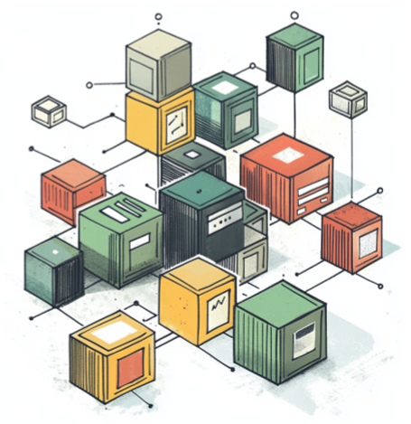
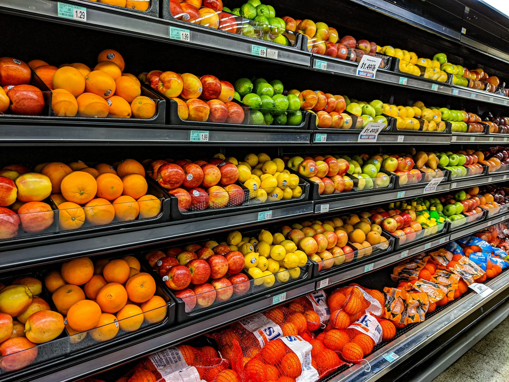
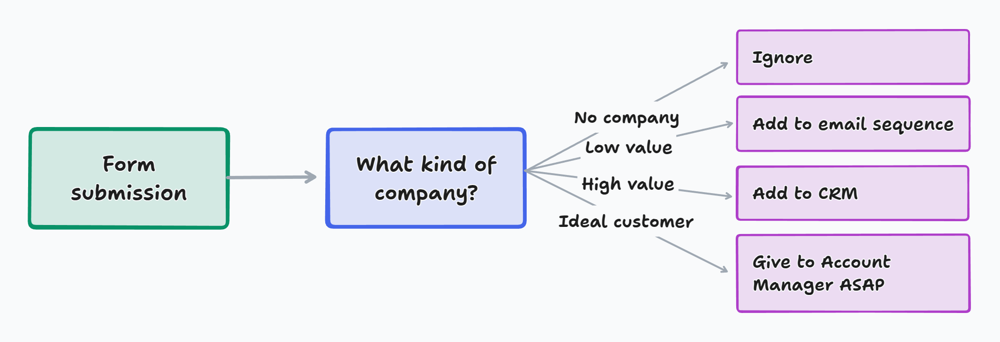
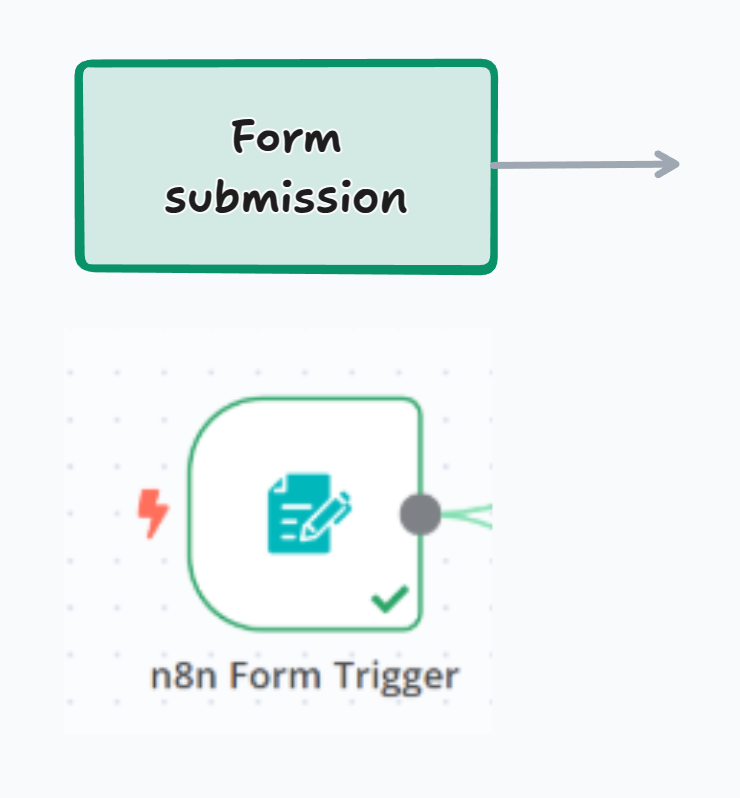
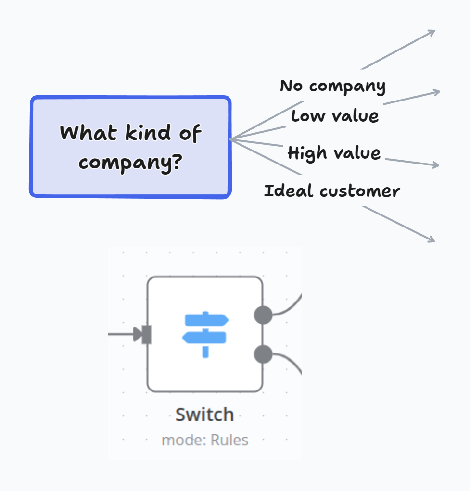
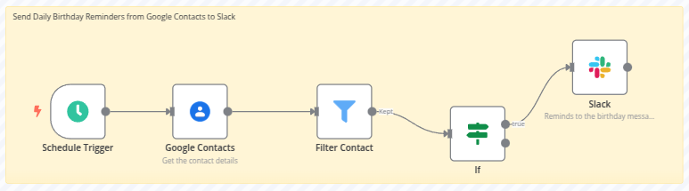

<!-- Mgmt Summary:
This presentation highlights the transformative power of workflow automation, particularly with n8n, a no-code platform that enables efficient, precise, and innovative processes. By automating repetitive tasks, organizations can reduce errors, enhance employee satisfaction, and make data-driven decisions. n8n's unique features include a visual interface, flexibility, and self-hosting options, making it ideal for anyone seeking to streamline workflows. By leveraging n8n, businesses can focus on higher-value activities and unlock their full potential.
-->

<!-- _class: first -->
<!-- _footer: '' -->

# The power of automation and how to control it.

Christoph Dyllick-Brenzinger
March 17th, 2025, LMU München

---

<!-- speaker notes 
Imagine walking into a supermarket, grabbing an apple and a chocolate bar, and simply walking out of the store without paying. Sounds like theft, right?

Well, that's exactly what I did yesterday in Munich. (Karlstraße 36). 

Luckly I wasn't arrested!

Two minutes later, I received a notification on my smartphone with a detailed list of my purchases and the charged amount. 

Welcome to the world of automation, where even the shopping process is revolutionized.
-->

---

<!-- speaker notes 
But this supermarket example is just the tip of the iceberg. 
Automation is reshaping industries across the board.
So, why exactly do we need automation? Let's explore the compelling reasons."
-->

<!-- _class: scoped -->

# Why do we need automation?

---

<!-- header: "Why do we need automation?" -->

<!-- speaker notes
Obviously automation is diffent to manual tasks. 
I think it is not difficult to explain this audience, why automations have some advantages in comparision to manual tasks. Your daily job is to create research setups where you can reproduce a result.
-->

# Manual vs Automation

  

  #### Manual tasks

  - Wasted time
  - Human error
  - High human resource requirements
  - Low employee happiness and retention

  
  #### Automation

  - Predictability
  - Better data availability
  - Increased employee efficiency
  - Focused efforts on higher-value taks
  - Much higher ROI

---

<!-- speaker notes 
So from my point of view, automation is key for data-driven decisions. 
It allows us to leave intuition behind and to generate data-driven, solid and reliable decisions and workflows.
-->

# Automation is key for data-driven decisions

  

  #### Feeling (intuition)

  - Subject to interpretation
  - Difficult to estimate and justify ROI
  - Wasted resources (Budget + Time)

  #### Data-Driven

  - Logic-driven and objectivity
  - Improved reporting + visibility on ROI
  - Requires fewer resources (Human, Budget, Time)

---

<!-- footer: "" -->

## What is automation?

<cite>A predictable set of predetermined actions that transfers data from one point to another</cite>

---

<!-- speaker notes 
Typicall structure of an automation:
- form submission
- filter
- one or many action

-->

# Typical structure of an automation

---

<!-- _class: scoped -->

# Core elements of automation

---

<!-- header: "Core elements of automation" -->

# Trigger

 

#### A trigger is what starts an automation.

- Manual
- Scheduled
- Applications
  - Webhook
  - Property update
  - Form submission

---

# Filter

 

#### Filtering is used to allow or block certain types of data from following a path based on certain conditions.

---

# Actions (Apps)

 

#### Actions allow you to interact with applications

 

  ##### Seafile:
  - Upload file
  - Get file
  - Create folder

  ##### Slack:
  - Get user
  - Send message
  - Get message

  ##### SeaTable
  - Update rows
  - Create new row

  #### Salesforce
  - Get contact
  - Get Company
  - Create lead

---

<!-- _header: "Workflow example" -->

# Send Daily Birtday Reminders from Google Contacts to Slack

---

<!-- _class: scoped -->

# What is n8n?

---

<!-- Speaker Notes:
visual interface to create workflow automations
"nodes" are predefined API connectors
-->
<!-- header: What is n8n?" -->

<cite>"n8n is a no-code workflow automation platform that lets you connect apps and automate tasks."</cite>

---

# Key Features

#### What makes n8n so special?

- Open Source (Fair Source)
- Visual Interface
- Flexibility (support for complex automation scenarios)
- Self-Hosting
- Community Nodes
- Coder Friendly
- AI integration 
  (**Don't miss my presentation on friday!**)

--- 

<!-- Speaker Notes:
Live-Demonstration to build a workflow in n8n. 
- Search for files with a specific tag in Seafile
- Create Download Link
- Send a slack message with this download link
- Remove tag from file
-->

<!-- _header: "If enough time" -->
<!-- _class: "scoped" -->

# Live-Demo:  Building n8n workflow

---

<!-- speaker notes:
This was a short introduction to n8n. 
Let us quickly talk about the question, who should use n8n?
I think, we could follow the advise of bill gates who stated
... a lazy person will find an easy way to do it...
-->
<!-- header: "The power of automation" -->

# Who should use n8n?

  

## "... a lazy person will find an easy way to do it"

― Bill Gates

---

<!-- speaker notes:
But I would rather change this recommendation to 
If you do a task more than one time, then automate it.
And n8n is the perfect tool to do that.
-->

# Who should use n8n?

  

## "If you do a task more than one time, then automate it."

― Christoph Dyllick-Brenzinger

---

<!-- speaker notes
Ladies and Gentlemen,

Workflow automation is the key to a more efficient, precise, and innovative future. It enables data-driven decisions, reduces errors, saves time, and makes processes reproducible.

Imagine a world where we can focus on what truly matters: creativity, innovation, and human interaction.

Automation frees us from monotony and gives us the freedom to unlock our full potential. It is not our adversary but our ally.

Are you ready to shape this future? Let’s create a world together where technology empowers us. Perhaps with n8n.

Thank you very much.
-->

<!-- generated from https://www.qrcode-monkey.com/ -->

# Interested in this presentation?

- online: https://christophdb.github.io/power-of-automation/.
- pdf: https://github.io/christophdb/power-of-automation/slides/slides.pdf